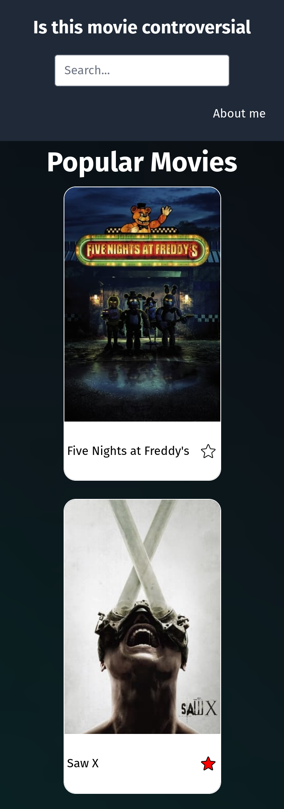

# This project was bootstrapped with [Create React App](https://github.com/facebook/create-react-app)

You can see it live at [Is this movie controversial?](https://is-this-movie-controversial.vercel.app/)

## This project uses

- TypeScript (TSX)
- React Router (pages management)
- Zustand (state management)
- Tailwind (mobile first)
- Local Storage (saving the favorites locally)
- TMDB API (movie lists and info)
- ChatGPT API for finding controversial information about a movie (and cast) (information up to 2021)

## 375px

.png>)

## 768px

.png>)

.png>)

## 1440px

.png>)

.png>)
